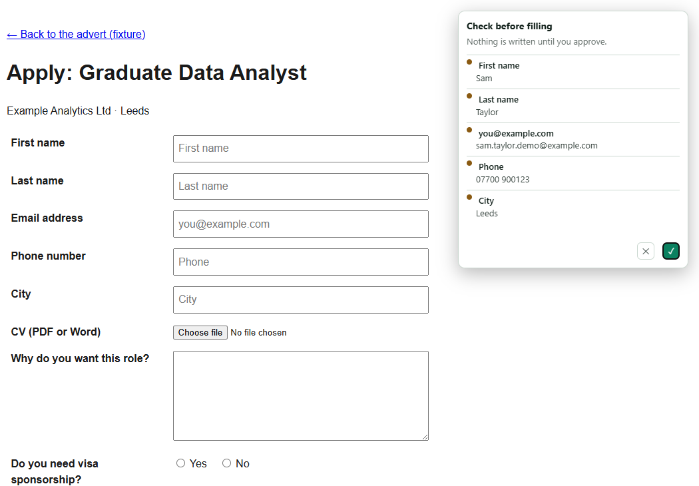
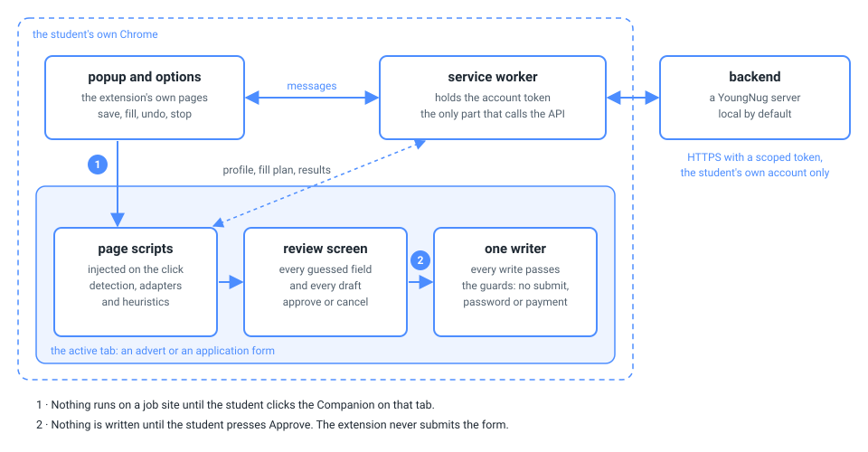
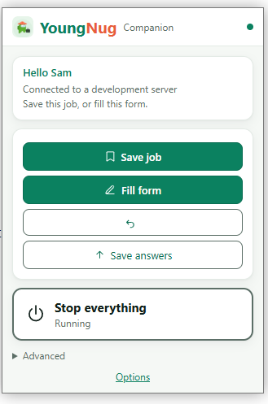
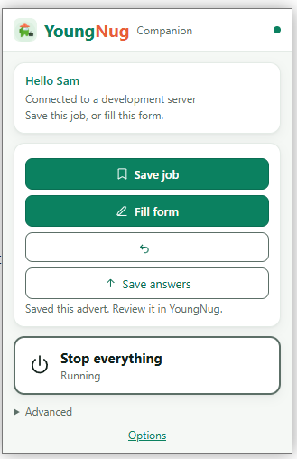
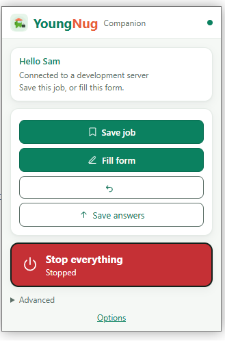
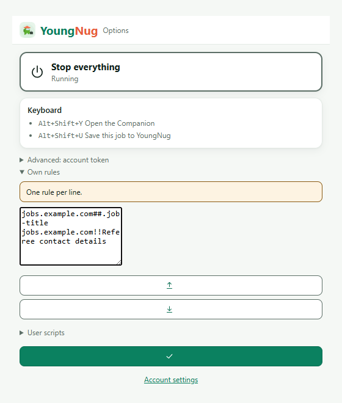
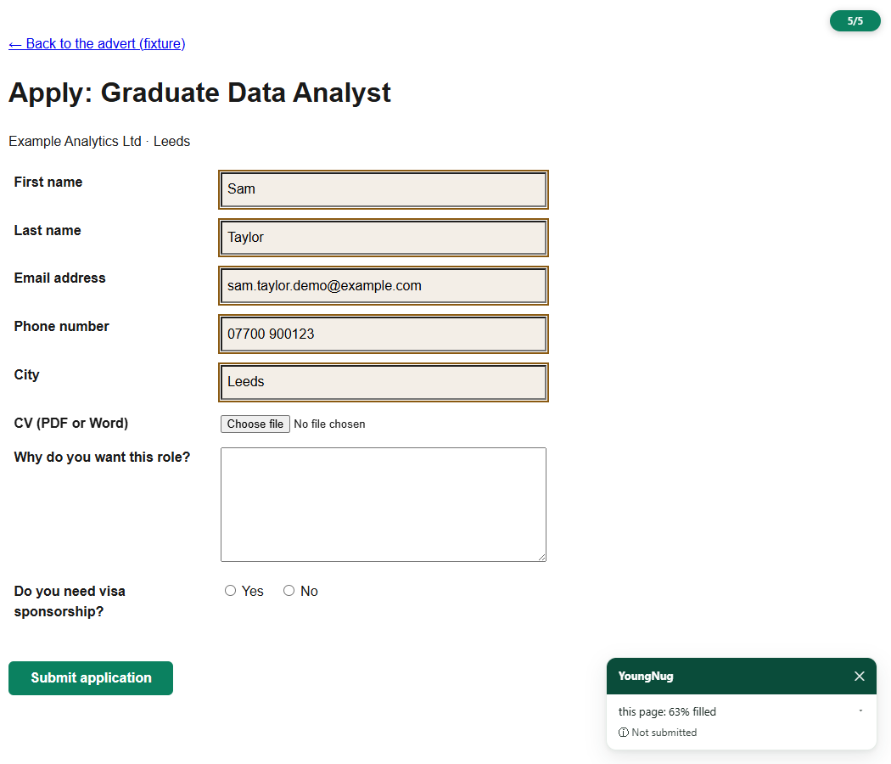
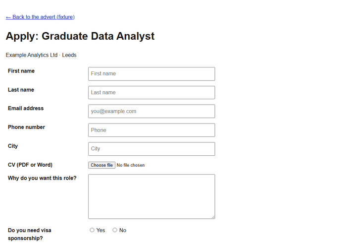

<div align="center">

# YoungNug Companion

### A Chrome extension that fills job applications from a student's profile, then stops

[](https://github.com/5Muawiyah/youngnug-companion/actions/workflows/tests.yml) &nbsp; &nbsp;

</div>

<p align="center"></p>

<p align="center"><i>The review screen. Nothing reaches the form until the student presses Approve, and Cancel writes nothing.</i></p>

The Companion is the browser half of [YoungNug](https://youngnug.com), a UK job-application platform. Muawiyah Jahanzaib built it so that a student who has written their profile once never types it into an application form again, and so that the software filling the form can never send it. This repository is the whole extension: source, build, tests and the analysis behind it. The platform it talks to is private.

| Document | What it covers |
|---|---|
| [Analysis](docs/ANALYSIS.md) | the process before and after, requirements with acceptance criteria, the decision log, outside constraints, what was measured |
| [Adapters](docs/ADAPTERS.md) | each applicant-tracking system with an adapter, and what happens without one |
| [Message contract](extension/MESSAGE_CONTRACT.md) | every message between the popup, the page scripts, the worker and the backend |
| [Notices](NOTICES.md) | the third-party code adapted into the tree, with its licence and the changes made |

## The problem, as a process

A UK student applying for graduate schemes, placements and apprenticeships fills in the same form many times. Competition is why: the Institute of Student Employers' 2024 survey [counted 140 applications per graduate vacancy](https://luminate.prospects.ac.uk/whats-the-state-of-graduate-recruitment-in-2024), the highest in more than thirty years. Every form asks for the same facts (name, email, phone, address, right to work, education, work history, a CV) and a few free-text questions that are the same question in different words.

By hand the process runs: open the advert, open the form, type the profile in field by field, upload the CV, answer the questions, read it through, submit, and record that it was sent. Two steps go wrong. The typing, because a transposed phone digit survives a tired read-through. The recording, because the application nobody tracked is the one whose interview invitation arrives as a surprise. One step must never be automated: the last click, because an application the student has not read is worse than one they did not send.

The Companion takes the typing and the recording. It leaves the reading and the sending.

## What it had to do

Each requirement can be tested; the [analysis](docs/ANALYSIS.md#requirements) names the test that holds each one.

1. **Capture an advert only from the page the student is reading, on their click.** The manifest carries no content script for any job site.
2. **Fill a form on a system it recognises, and do something useful on one it does not.** Recognised systems get an adapter; every other form gets a heuristic ladder that reads labels, `autocomplete` tokens, field names and ARIA roles.
3. **Show every uncertain write before making it.** A guessed field or a drafted answer is a row on the review screen, and a cancelled review writes nothing.
4. **Never submit, never solve a captcha, never pass a login wall.**
5. **Never write what the student did not give it**: no password, payment field, demographic answer, sensitive question, hidden bot-trap field, or field already filled.
6. **Stop when told, with the network down.**
7. **Undo only what it wrote.**
8. **Stay rebuildable**: the shipped files are build output of `extension/src/`, and a test fails if they drift from a fresh build.

## How it works

<p align="center"></p>

The **popup** and **options page** are ordinary extension pages. The **service worker** holds the account token and is the only part that talks to the backend. The **page scripts** are injected into the active tab on the student's click through Chrome's `activeTab` grant. The **backend** is a YoungNug server, local by default, holding the profile and the approved applications.

A fill runs as a ladder. Detection names the system from the URL, with a DOM fingerprint as a tiebreak, and `unknown` is an honest answer. The system's adapter claims the fields it knows, the student's own site rules go next, and label-reading heuristics take what is left; an optional local model, off by default, is the last rung. Every intent then passes through one writer, `ynExecuteIntents`, where the guards live, so a mis-planned intent cannot reach a password or payment field whichever rung produced it. Each write dispatches the events a framework listens for and is read back to confirm it held.

The source sits in six layers (`common`, `kit`, `engine`, `adapters`, `filler`, `ui`), each shipped file bundled by esbuild from its own folder, and a test refuses any import that crosses between those folders.

## The safety model

- **One click.** Capture and fill run only on the student's click on that tab. "Search all sites" opens at most four visible tabs per click from a fixed list of eleven hosts.
- **A captcha is a hard stop.** A challenge page, bot gate or sign-in interstitial ends the flow with a named reason. A captcha widget sitting on an ordinary form (Lever and Ashby ship one on every apply page) does not stop the fill; the overlay says the student will solve it when they submit.
- **It never submits.** `ynSubmitGuard` refuses a click on any `type=submit` control, or on one whose name means submit, apply now, finish, post job, publish, confirm or pay. Multi-step wizards are detected, never advanced.
- **Review before write.** A drafted answer is written only if the student approves its own row.
- **The kill switch is local.** It lives in `chrome.storage.local`, is checked before any request, and no server message can clear it. The account-level stop the platform can raise is weaker, and documented as such, because it can only arrive over the network.
- **Least privilege.** Permissions are `storage`, `activeTab`, `scripting`, `tabGroups` and `userScripts`, with no `<all_urls>` in the store build; the build script refuses `debugger` and `nativeMessaging` in every build.

## A closer look

<p align="center"></p>

**The popup.** Save job reads the advert on the open page, Fill form runs the ladder, the undo icon reverts the last fill, and Save answers stores the answers typed on this page after showing exactly what it would save. Alt+Shift+Y opens it; Alt+Shift+U saves the job without opening it.

**Capture.** A single advert is read from its `JobPosting` structured data first, then by a per-site reader, then by a generic heuristic. On a results page only the cards already on screen are read. Thirteen job sites have a results-page reader.




<br clear="all">

<p><i>Left: after Save job on a fixture advert. Right: Stop everything switched on; every request is refused before it is made, and only the student can turn it off.</i></p>

<p align="center"></p>

**The options page.** The stop switch, the keyboard shortcuts, the account token, and the student's own site rules in an adblock-style syntax: a capture selector, a label-to-profile mapping, a never-fill label, or a never-touch site. On Chrome 138 or later, with the browser's own toggle on, it also holds user scripts for named sites.

<p align="center"></p>

**A filled form.** After Approve the fields are written and outlined. The CV, the free-text question and the visa question stay empty, because the profile holds nothing it could honestly put there. The overlay gives the share of the page filled and says nothing was submitted; expanded, it lists every field by outcome.

<p align="center"></p>

<p align="center"><i>Every screenshot is a fixture page on a local server, signed in as an invented student.</i></p>

## What it does not do

- **Some adapters are thin.** Dover and SAP SuccessFactors have no detection rule yet, so those pages run on the heuristics alone. Taleo's adapter is empty by design, because the platform has no stable field scheme, and Workday's rests on public convention not confirmed past the account wall.
- **Signed-in surfaces change without notice.** The LinkedIn Easy Apply, Reed and Indeed Apply adapters match label text rather than generated ids, which survived one LinkedIn redesign; the next may still break them. A broken adapter leaves a form unfilled, not wrongly filled.
- **The review screen fails open.** If its script fails to load, the fill proceeds as if approved and logs an error, on the view that a missing file is a bug to fix rather than a silent block. A reader may disagree.
- **It needs a backend.** Without a YoungNug server the popup connects to nothing; the tests exercise the engine without one.
- **The job-board readers are tested less here than privately.** Their private tests use reductions of real results pages, which cannot be published; here they rest on constructed fixtures.
- **Chrome only.**

## Getting started

```
git clone https://github.com/5Muawiyah/youngnug-companion.git
```

1. Open `chrome://extensions`, turn on Developer mode, choose **Load unpacked**, and select the `extension/` folder.
2. The backend address defaults to `http://127.0.0.1:8000`. To use a hosted YoungNug instance, change it on the options page; the extension accepts `https://youngnug.com` or the local development ports.
3. Sign in to the web app in the same browser. The page hands the extension a scoped token, and the popup shows a live connection check. The password is never stored.

### Rebuild from source

```
npm ci
python scripts/build_extension.py
```

This installs a pinned esbuild and jsdom, bundles every entry in `extension/src/entries.json` into its shipped path, and packs two builds under `dist/`. The store build is the checked-in manifest; the full build adds `<all_urls>`, `notifications` and `downloads` for multi-step forms that lose the per-click grant, and is for people who install it themselves.

## Run the tests

```
pip install -r requirements-dev.txt
python -m playwright install chromium
python -m pytest -q
npm run test:node
```

The suite runs the real shipped files under jsdom and, where a fixture needs real layout or shadow DOM, under headless Chromium. It pins each build's permissions, the never-submit rules, the module graph, the length of the popup's copy, the colour contrast, and that every shipped file equals a fresh build. It needs no network: a fixture that reaches for one fails.

## The adapters

[docs/ADAPTERS.md](docs/ADAPTERS.md) is generated from the adapter headers, so it cannot drift: Ashby, Dover, Greenhouse, iCIMS, Indeed Apply, Indeed employer posting, Lever, LinkedIn Easy Apply, Personio, Pinpoint, Recruitee, Reed, SmartRecruiters, SuccessFactors, Taleo, Teamtailor, Workable and Workday, plus two shared modules for reopening a collapsed wizard section and for stopping a fill that navigates to a different job.

## Licence and notices

Apache License 2.0; see [LICENSE](LICENSE) and [NOTICE](NOTICE). Parts of the fill engine are adapted from open-source autofill projects under Apache-2.0, MIT and BSD-2-Clause; each lifted block is marked in the source, and [NOTICES.md](NOTICES.md) lists every project with its licence and the changes made.

---

<div align="center"><sub>Built by Muawiyah Jahanzaib. Apache-2.0. It fills the form and stops; the student sends it.</sub></div>
