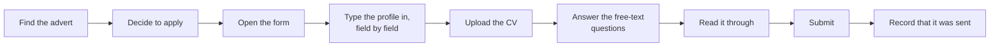
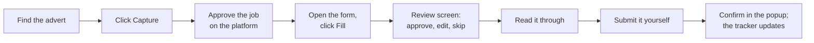

# Analysis

The business case, the requirements and the decisions behind the Companion, written before the build
detail because the reasoning is what a reader can check the code against. Every number here comes
from this repository or from a named source; where a figure is an estimate it says so.

## The process before and after

**Before.** A student applying for a graduate scheme, a placement or an apprenticeship works through
the same sequence for every vacancy:

Steps D, E and F are copying: the facts already exist in the student's profile and CV, and the
questions repeat across employers in different words. Step I is the one most often skipped, which is
how an interview invitation arrives for an application nobody remembers sending. Steps G and H are the
ones that must stay human: an application the student has not read is worse than one they did not
send.

The scale is the reason it matters. The Institute of Student Employers' Student Recruitment Survey
2024 ([reported by Prospects Luminate](https://luminate.prospects.ac.uk/whats-the-state-of-graduate-recruitment-in-2024))
reported an average of 140 applications per graduate vacancy, the highest it had recorded in more
than thirty years. Every one of a student's applications repeats the same facts, and every repeat is
another chance to transpose a phone digit or give last year's address.

**After.** With the Companion installed and connected to a YoungNug backend:

The copying steps are gone. The human steps are still human, and two of them (the approval before
the fill, the review before the write) are new gates the manual process never had.

## Requirements

Each requirement is written with the criterion that decides it and the test in this repository that
holds it. The test names are the files under `tests/`; the Node runners they call live under
`tests/ext_fixtures/` and evaluate the real shipped files.

| ID | Requirement | Acceptance criterion | Held by |
|---|---|---|---|
| REQ-01 | Capture runs only on the student's click on that tab | The manifest's `content_scripts` match only the app's own origin and the local development ports; capture and fill scripts are injected through `activeTab` at click time | `test_extension_builds.py`, `test_extension_pack_contents.py` |
| REQ-02 | A recognised system is filled by its adapter; an unrecognised one by the heuristic ladder | Detection returns the adapter id for its URL rule and `unknown` otherwise; a fixture form with no adapter still resolves name, email and phone | `test_extension_adapters_and_repeaters.py`, `test_extension_field_discovery.py`, `test_extension_generic_fill.py` |
| REQ-03 | Every uncertain write is shown before it is made | With the review screen open the DOM diff is zero; exactly one Approve releases the write; Cancel writes nothing and reports nothing | `test_extension_review_screen.py`, `test_extension_review_cancel.py` |
| REQ-04 | It never submits | The strings `auto_submit` and `"submitted"` do not appear in the page scripts; `ynSubmitGuard` refuses the terminal control names; wizards are detected, never advanced | `test_extension_pack_contents.py`, `test_extension_keyboard_guard.py`, the never-submit checks in the runners |
| REQ-05 | A challenge or sign-in page is a hard stop | The fixture challenge pages end the flow with `captcha_stop` or `login_required` and no write | `test_extension_field_discovery.py` (text-phrase captcha fixtures), `test_extension_generic_fill.py` |
| REQ-06 | Passwords, payment fields, demographic and sensitive questions, honeypots and the student's own values are never written | Each class has a fixture; the write layer refuses the intent at execution time whichever rung planned it | `test_extension_write_verify.py`, `test_extension_field_discovery.py`, `test_extension_screening.py` |
| REQ-07 | The kill switch works with the network down | With the switch on, every `fetch` is rejected and the call count is zero | `test_extension_killswitch.py` |
| REQ-08 | Undo reverts only what the Companion wrote | Six fields written then reverted by one Undo; a second Undo reverts nothing; a value already on the page stays | `test_extension_undo_and_contenteditable.py` |
| REQ-09 | Writes are real to the framework underneath | React-controlled inputs and masked-input libraries hold the value after the write; the value is read back and verified | `test_extension_write_verify.py`, `test_extension_cascade_and_keystroke.py` |
| REQ-10 | The shipped files equal a fresh build of their source | Byte-identical output from `scripts/build_extension.py` for every entry | `test_extension_build_no_drift.py`, `test_extension_module_graph.py` |
| REQ-11 | The interface stays short | Every chrome string under 25 words, every screen's chrome prose under 80, icon-only controls carry an accessible name | `test_extension_density.py`, `test_extension_copy.py` |
| REQ-12 | The colours the extension paints clear WCAG AA | Every foreground/background pair declared in `ext.css` computes to at least 4.5:1 for body text, and 3:1 for large text and controls | `test_extension_branding.py` |

## Decision log

Each decision names the alternative that was rejected and why. The order is roughly the order the
questions came up.

| Decision | Alternative rejected | Why |
|---|---|---|
| **Fill in the student's own signed-in browser** rather than from a server | A server-side apply bot with the student's credentials | It would hold the student's passwords for every job site, it would be the site's terms of service violated from one IP address, and every captcha would be the product's problem instead of a human's ten seconds. |
| **Inject on click through `activeTab`** rather than a content script on every job site | A `<all_urls>` content script that is ready before the click | The store build would carry the widest host permission there is, a reviewer's first question, and the extension would be reading pages nobody asked it to read. The cost is real: a multi-step form that navigates loses the grant, which is why a separate full build exists for people who install it themselves. |
| **Never submit** | An "auto-apply" option, off by default | An automation that submits on a person's behalf is a liability the product chose not to carry, and an option that exists gets turned on. The rule is enforced in code and by a test that forbids the strings that would implement it. |
| **A review screen before the write** rather than an overlay after it | Fill first, list what was done, offer Undo | Undo after the fact still means the value was on the page; on a form that autosaves, "was on the page" is "was sent to the employer". Exact profile facts (name, email) do not need a row; anything guessed or drafted does. |
| **Adapters return intents; one writer executes them** | Each adapter writes its own fields | Every guard would have to be repeated in every adapter and one forgotten guard is one password written. With one writer the refusal is checked against the live element at write time, whoever planned the intent. |
| **A local kill switch, and a softer account-level stop** | One stop, controlled from the platform | A stop that needs the network is not a stop. The account-level stop exists so a misbehaving install can be halted from the site, and the documentation says plainly that it is the weaker of the two. |
| **The store manifest is the source of truth; the full build derives from it** | Ship the full build's manifest and strip permissions for the store | The safest manifest should be the one a reader sees first, and a build step that adds permissions is easier to audit than one that removes them. `debugger` and `nativeMessaging` are refused in both. |
| **Shipped files are committed build output, with a drift test** | Build in CI only, commit the source alone | Loading unpacked from a clone and packing a zip on the server both read the shipped paths; a build step there is a step that can be skipped. The drift test makes the committed copy honest. |
| **Deterministic heuristics first; a local model last and off** | A hosted language model resolving every field | Cost per fill would scale with volume; the field label would leave the browser; and a model guessing a right-to-work answer is exactly the class of write the product refuses. The local model runs only on the student's own machine, is off by default, and its guesses are always amber. |
| **"Search all sites" opens at most four visible tabs per click** | Open a tab per registered site (eleven) | One click must never become an unbounded burst, and four tabs is what a person can look at. Adding a site raises the list, not the bound. |
| **Own rules and user scripts belong to the student** | Keep configuration in the product | Sites the product has never seen still need filling. A rule is a mapping and passes every guard; a user script is the student's own code, runs in the browser's `USER_SCRIPT` world behind Chrome's own toggle, and the options page says in one line that the never-submits promise does not cover it. |
| **Publish under Apache-2.0** | MIT, or keep it private with the platform | The largest adapted source is Apache-2.0, so the repository's own licence matches it and carries the required `NOTICE`. Publishing the client separates what runs on the student's machine, which they are entitled to read, from the platform, which stays private. |

## Constraints from outside

- **Chrome Web Store policy.** A Manifest V3 extension may not load remote code, must justify each
  permission, and is reviewed harder for broad host permissions. That is why the store build carries
  `activeTab` and no `<all_urls>`, why the user-scripts feature sits behind Chrome's own per-extension
  toggle, and why `debugger` is refused outright.
- **Job sites' terms.** LinkedIn, Indeed and Glassdoor prohibit automated collection. The Companion
  reads a page only in the student's own session, on their click, one page per click, with no
  pagination and no background fetch, and reports a bot gate as a stop rather than something to get
  past. The results-page readers read what is mounted in the DOM and nothing more.
- **UK GDPR.** The profile, the applications and the captured adverts are the student's own data,
  held in their own account. The extension stores a scoped account token and never the password;
  the LinkedIn and GitHub imports run on a consent click and every imported row carries a review
  marker until the student saves it. Sensitive categories (health, criminal record) are never
  filled. The kill switch and the account deletion on the platform are the student's stop controls.
- **Accessibility.** Icon-only controls carry an accessible name, the colour pairs the extension
  paints clear WCAG AA, and on the review screen Approve takes focus when it opens and Escape
  cancels, so a student on a keyboard or a screen reader can decide without a mouse.

## What was measured

The figures below are read from this repository at the tagged release; the command that produces
each is beside it.

| Measure | Value | From |
|---|---|---|
| Application systems with a dedicated adapter | 18 (17 candidate-side, 1 employer posting) | `ls extension/src/adapters`: 20 folders, 2 of them shared modules |
| Job sites with a results-page reader | 13 | the generated table in `extension/MESSAGE_CONTRACT.md` |
| Hosts "Search all sites" may open, and the per-click tab bound | 11 hosts, 4 tabs | `YN_FANOUT_HOSTS` in `extension/background.js`; `YN_FANOUT_MAX_TABS` in `extension/content/app_bridge.js` |
| Per-site daily page cap | 40 by default, 200 at most | `ynSettings()` in `extension/common/api.js` |
| Source under `extension/src/` | 25,827 lines in 142 files, 4,307 of them in the adapters | `find extension/src -name '*.js' \| xargs cat \| wc -l` |
| Fixture forms and pages, and the Node runners that evaluate the shipped files against them | 102 HTML fixtures, 54 runners | `find tests/ext_fixtures -name '*.html'` and `-name '*.mjs'` |
| Fill coverage across the eleven application-form fixtures | 27 of 33 attemptable fields filled (82%); three fixtures have nothing to attempt, because every field is already the student's own value or the step has no field | `python tests/ext_fixtures/coverage_table.py` |
| Python tests | 238 passed, 0 failed | `python -m pytest -q` |

Coverage is filled fields divided by the fields the extension was allowed to attempt: a guard refusal
(password, demographic question, payment, terms) and a field the student had already filled are
removed from both sides, so the figure cannot be raised by weakening a guard. It is measured on
fixture forms, not on live applications, so it says how the ladder behaves on known shapes and nothing
about any particular employer's form.

What is deliberately **not** claimed: a time saved per application, or an application count per
student. Neither has been measured on real users, and a figure without a measurement behind it is
the kind of claim this document exists to avoid.
